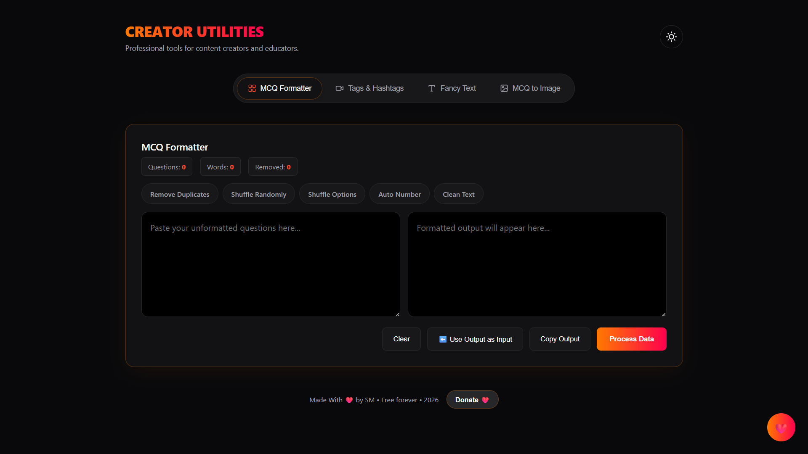
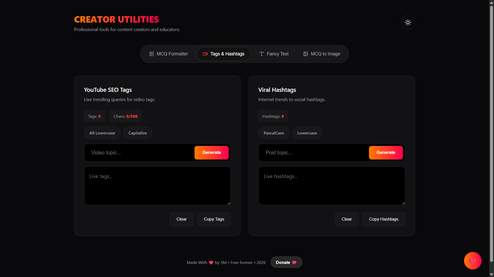
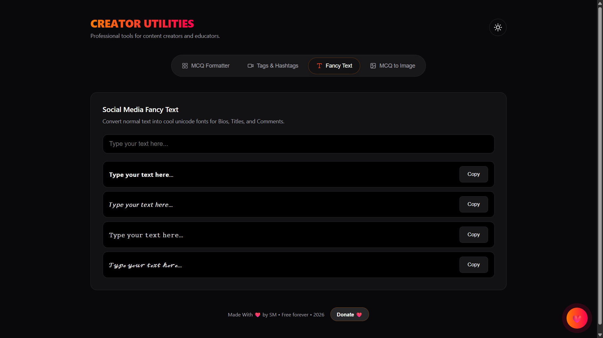
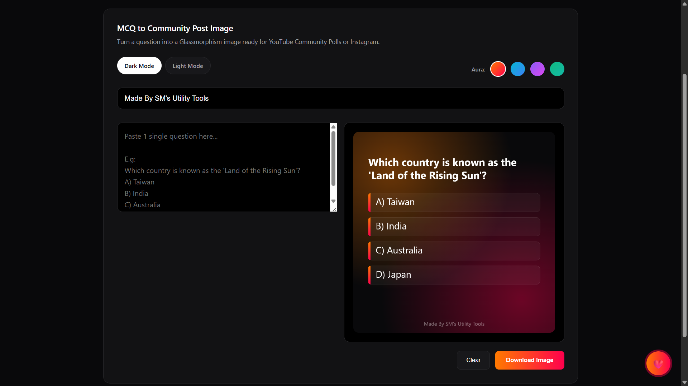

  

<h1 align="center"> Creator's Tools</h1>

  ⚡ Smart toolkit for creators, educators, and content makers 
  <i>Format • Optimize • Generate • Create</i>

  

---

## 📸 Preview

### 🧠 MCQ Formatter

  

### 📈 Tags & Hashtags Generator

  

### 🎨 Fancy Text Generator

  

### 🖼️ MCQ Image Generator

  

---

## ✨ Overview

Creator's Tools is a **fast, lightweight, browser-based toolkit** designed to simplify content workflows — from formatting MCQs to generating SEO tags, hashtags, and social media visuals.

  <b>🚀 Fast • 🔒 Private • 📱 Responsive • 🧩 All-in-One</b>

---

## 🧰 Features

- 🧠 **MCQ Formatter** – Clean, deduplicate, shuffle, auto-number, and view stats  
- 📈 **YouTube Tags Generator** – Generate SEO-friendly tags with smart suggestions  
- 🔥 **Hashtag Generator** – Create relevant hashtags with intelligent expansion  
- 🎨 **Fancy Text Generator** – Convert text into stylish Unicode fonts (1-click copy)  
- 🖼️ **MCQ Image Generator** – Export MCQs as shareable images with themes  

---

## 🎯 Who It's For

- 📺 YouTube quiz & GK creators  
- 📚 Teachers and educators  
- 🧠 Competitive exam preparation  
- 📢 Social media creators  
- 📝 Bulk MCQ processing  

---

## ❤️ Support & Donations

  

  <b>💸 Support this project</b> 
  Scan to donate via UPI ❤️

---

## ⚡ Highlights

- 🌐 100% browser-based  
- 🔒 No data storage (privacy-friendly)  
- ⚡ Fast and lightweight  
- 📱 Fully responsive design  
- 🧩 Multiple tools in one place  

---

## 🛠️ Tech Stack

- 🌐 HTML  
- 🎨 CSS  
- ⚙️ JavaScript  

---

## 📂 Project Structure

CreatorsTools/  
├── index.html  
├── style.css  
├── script.js  
├── upi.jpeg  
└── README.md  

---

## 👨‍💻 Creator 

  

  <a href="https://github.com/CoderSugata">

---

## ⭐ Final Note

  ❤️ Built for creators — simple, powerful, and free forever. Give it a ⭐

  

